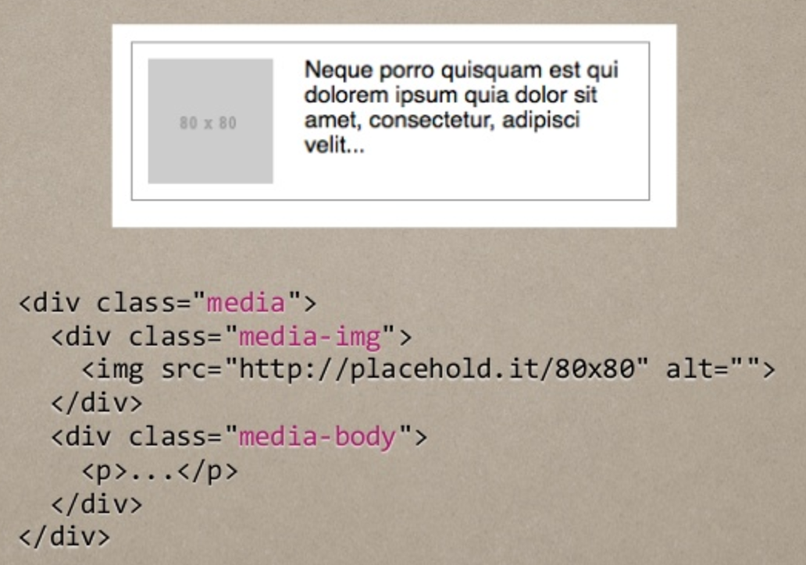
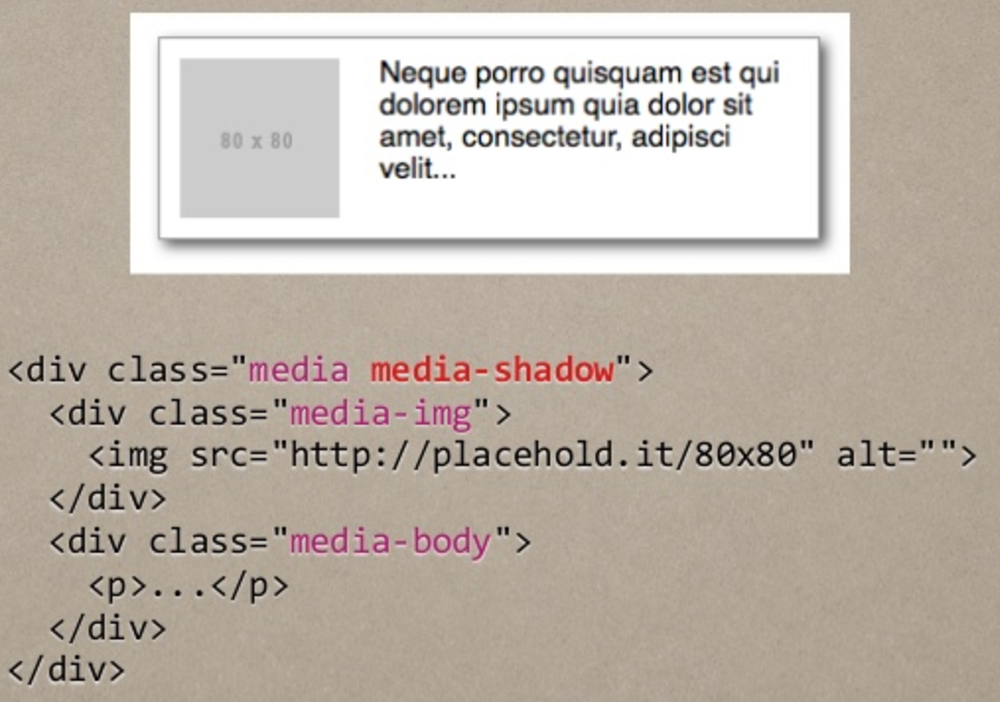
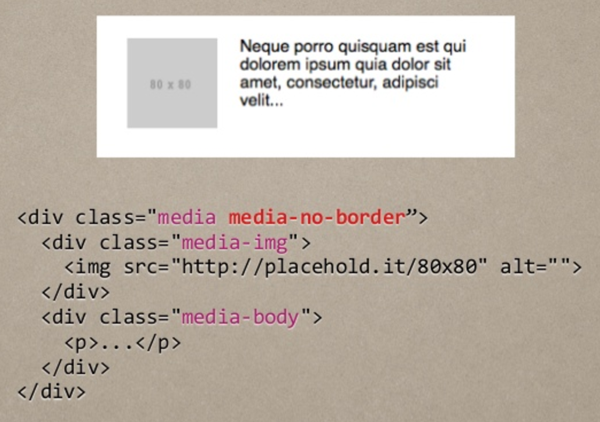

# OOCSS

**OOCSS兩大原則**

```html
<div class="panel panel-primary">
  <div class="panel-heading">
    <h3 class="panel-title">Panel title</h3>
  </div>
  <div class="panel-body">
    Panel content
  </div>
</div>
```

* 結構與外觀分離
  * 結構
    * media
    * media-img
    * media-body
  * 外觀
    * media-no-border
    * media-shadow
* 容器與內容分離

**基本結構**



**粗框**



**無框**




資料來源：[漫談 CSS 架構方法 - 以 OOCSS, SMACSS, BEM 為例](http://www.slideshare.net/kurotanshi/css-oocss-smacss-bem)