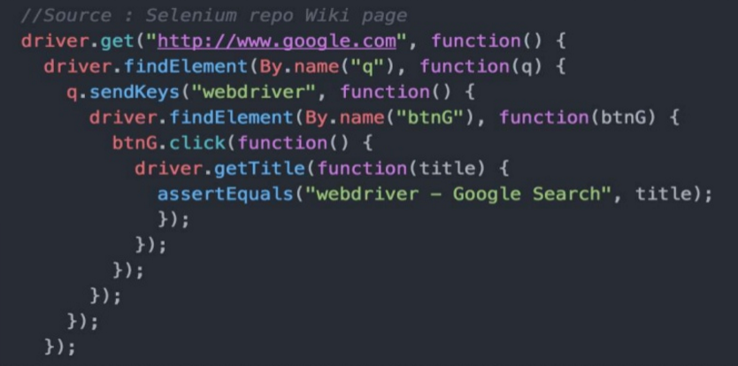

# Callback

* 是 Javascript 語言中要達成非同步概念的「最小基本單元」」

<!--
step1 現在就要做
step2 可以等久一點的時間在做
-->

### 原理

* 將函式傳給另一個函式

```js
function step1(message, callback){
  console.log('step1');
  step2(callback);
}

function step2(callback){
  console.log('step2');
  callback();
}

step1('Hello World', function(){
  console.log('callback');
});
```

step1 函式把 callback 函式傳給 step2 函式，告訴 step2 函式執行完後，呼叫 callback 函式。

<!-- step1, step2, callback -->

### 使用情境

* 非同步事件
* 需要先做某事，結束後接續做另一件事。

### 缺點

* callback 表達非同步執行流程的方式，相當的非循序式，使得難以推理程式的運作邏輯。
* 控制反轉 (inversion of control) 導致的信任問題

**控制反轉(IOC)**

* 將控制權交給另一方

<!--* 我們寫的程式或許是非同步的，但我們的大腦是循序式的，而且擅長單工，所以我們很容易陷入不知道現在程式邏輯跑到哪了。-->

### Callback 地獄

**信任問題**

* 傳了 callback 函式給另一個函式，但是它結束的時候沒 call。
* 預期只會 call 一次，但 call 了好幾次。
* 發生錯誤或例外狀況時，沒有接到 callback。

<!-- 我們可以把 callback hell 拆解成外部函式放在其他地方，但我們在看程式碼的時候，就比較要在各個函式之間跳來跳去不容易閱讀。-->

```js
function step1(message, callback){
  console.log('step1');
  callback();
}

function step2(message, callback){
  console.log('step2');
  callback();
}


function step3(message, callback){
  console.log('step3');
  callback();
}


function step4(message, callback){
  console.log('step4');
  callback();
}

step1('Hello World', function(){
  step2('Hello World', function(){
    step3('Hello World', function(){
      step4('Hello World', function(){  
  
      });
    });
  });
});
```



### 範例

[demo](https://www.w3schools.com/jquery/jquery_callback.asp)

```js
$("button").click(function(){
    $("p").hide("slow", function(){
        alert("The paragraph is now hidden");
    });
});
```