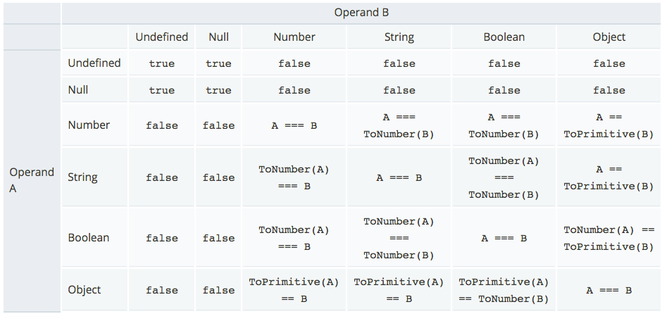

# 強制轉型 & 比較

## 強制轉型 (coercion)

### 轉換成布林

輸入       | 結果      | 輸入     | 結果
----------|----------|----------|----------
1         | true     | 0        | false
object    | true     | undefined| false
"hi"      | true     | NaN      | false
          |          | ""       | false     
          |          | null     | false

### 轉換成數字

輸入       | 結果      | 輸入     | 結果
----------|----------|----------|----------
undefined | NaN      | number   | 原來的值
null      | 0        | string   | 原來的值
true      | 1        | object   | 表示此物件預設的代表數字
false     | 0

### 範例

**範例一**

```js
console.log(false < 1); // 答案是？
```

<!-- true -->

**範例二**

<!-- 有些人認為轉換很複雜，不想了解，反正不重要，真的嗎？ -->

```js
// not good, why?
var b = null;
if(b == null || b == undefined || b == '') {
  console.log('flow 1');
} else{
  console.log('flow 2');
}
```

**範例三**

```js
// good job
var b = null;
if(b) {
  console.log('flow 2');
} else{
  console.log('flow 1');
}
```

**範例四**

```js
var a = {};
if(a) {
  console.log('flow 1');
} else{
  console.log('flow 2');
}
```

## 比較 (comparison)

關係運算子：一個運算元與另一個運算元相比較。

**等於**

* ===：Strict equality
* ==：Loose equality

```js
var x = 5;
console.log(x == 5); 
console.log(x == "5");
console.log(x === "5");
```
<!-- true, true, false -->

**隱式類型轉換**



* null 跟 undefined 是兄弟檔，跟其他人都不合。
* Object 做 ToPrimitive
* Boolean 跟 String 做 ToNumber

```js
console.log(null === undefined);  // false
console.log(null == undefined);   // true

// null == null, null == undefined 是 true
console.log(null == 0); // false
// ToNumber(A) < B
console.log(null < 1);	// true

// ToNumber(A) === B
console.log("" == 0); // true
// ToNumber(A) === ToNumber(B)
console.log("" == false);

console.log(0 == false);	// true
console.log(0 === false);	// false

console.log("1.0" <= 2.0);  // true
```

### 延伸閱讀

* [Equality comparisons and sameness - JavaScript | MDN](https://developer.mozilla.org/en-US/docs/Web/JavaScript/Equality_comparisons_and_sameness)

